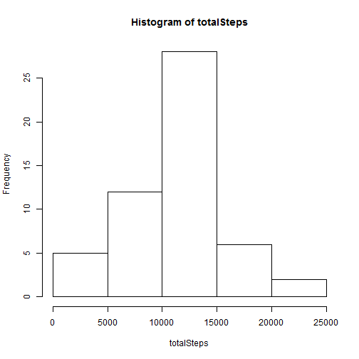
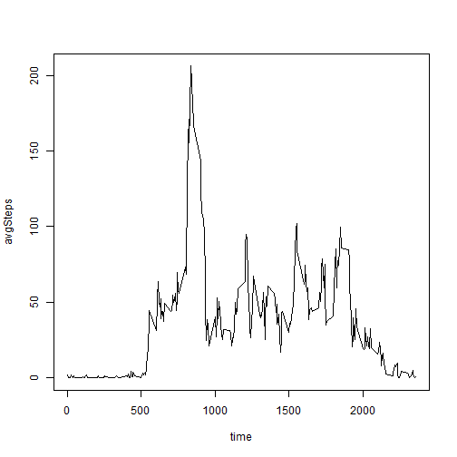
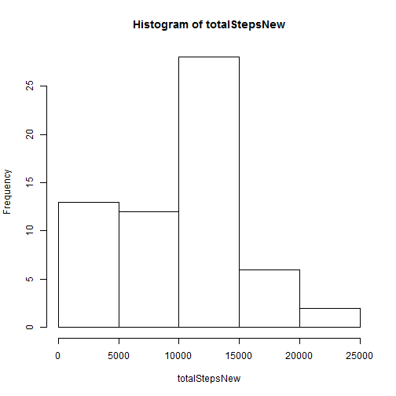
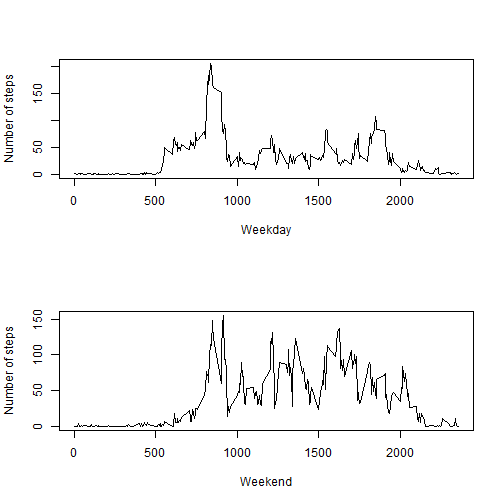

Analysis of activity monitoring data
========================================================

Loading and Preprocessing the data
----------------------------------

```r
# Loading data
activityData <- read.csv("activity.csv")
activityData$date <- as.Date(as.character(activityData$date))
```


Mean total number of steps taken per day
----------------------------------------

```r
# filtering out missing data
data1 <- activityData[!is.na(activityData$steps), ]
# total steps per day
totalSteps <- tapply(data1$steps, data1$date, sum)
hist(totalSteps)
```

 

```r
mean(totalSteps)
```

```
## [1] 10766
```

```r
median(totalSteps)
```

```
## [1] 10765
```

Average daily activity pattern
-------------------------------
For calculating the average daily pattern, i have defined a function so we can reuse it in later parts of the assignment


```r
# function
avgPattern <- function(data) {
    avgSteps <- tapply(data$steps, data$interval, mean)
    df <- data.frame(time = names(avgSteps), avgSteps = avgSteps)
    df$time <- as.numeric(as.character(df$time))
    df <- df[order(df$time), ]
    return(df)
}

df <- avgPattern(data1)
plot(df$time, df$avgSteps, type = "l", xlab = "time", ylab = "avgSteps")
```

 

```r
maxInterval <- df[which.max(df[, 2]), 1]
```

The interval with maximum number of steps on average across all days is 835

Imputing missing values
-----------------------

```r
numMissing <- sum(is.na(activityData$steps))
```

We can see that there are 2304 missing values in the steps column in the given data set.
I have used the median of a particular interval to fill the missing data for that interval. Since the data is skewed I preferred using the median instead of the mean. filledData contains the new data set with the missing values filled as the median value for that time interval


```r
# calculating median
medianSteps <- tapply(data1$steps, data1$interval, median)
medianData <- data.frame(time = names(medianSteps), med = medianSteps)
filledData <- merge(activityData, medianData, by.x = "interval", by.y = "time")
# filling missing data
filledData$steps[is.na(filledData$steps)] <- filledData$med[is.na(filledData$steps)]
# removing median column
filledData <- filledData[, 1:3]
totalStepsNew <- tapply(filledData$steps, filledData$date, sum)
hist(totalStepsNew)
```

 

```r
mean(totalStepsNew)
```

```
## [1] 9504
```

```r
median(totalStepsNew)
```

```
## [1] 10395
```

We can see that the mean and median are lesser compared to the original data. This is because there are more observations now with lesser values and we can see this from the two histograms

Differences in activity patterns
--------------------------------
I created a new factor variable dayType whch indicates if it is a weekday or a weekend.

```r
filledData$dayType <- as.factor(ifelse(weekdays(filledData$date) %in% c("Saturday", 
    "Sunday"), "Weekend", "Weekday"))
par(mfrow = c(2, 1))
part1 <- filledData[filledData$dayType == "Weekday", ]
part2 <- filledData[filledData$dayType == "Weekend", ]
df1 <- avgPattern(part1)
plot(df1$time, df1$avgSteps, type = "l", xlab = "Weekday", ylab = "Number of steps")
df2 <- avgPattern(part2)
plot(df2$time, df2$avgSteps, type = "l", xlab = "Weekend", ylab = "Number of steps")
```

 

